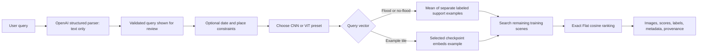

# Milestone 10 — Natural-language query and exact evidence retrieval

## Goal

M10 adds a local interface for expressing the supported SEN12-FLOOD retrieval task in natural language and inspecting exact image evidence. It does not generate an answer or claim that the scratch image encoders are aligned with language.



## Query contract and parser

`EOQuery` represents flood/no-flood intent, optional inclusive dates, a country or first-order administrative region, an optional RGB or twelve-band preference, an optional example tile ID, unsupported conditions, and the original query. The API validates the parser output before retrieval. The UI presents the interpretation and requires a deliberate place choice when names are ambiguous.

The OpenAI Responses API parser receives only query text. It does not receive tiles, rank candidates, judge relevance, or generate a final geospatial answer. The backend reads `OPENAI_API_KEY` from `.env`; the browser never receives it.

## Query vectors, support examples, and gallery

Each M9 run is one exact architecture/modality/seed checkpoint and embedding space. Embeddings from different runs are never mixed. For the flood/no-flood prototype mode, a fixed sequence-grouped 20% of the M9 training scenes (345 of 1,708 in the current data copy; seed 17) define the two class prototypes. The remaining 1,363 training scenes form the searchable gallery. A full sequence stays on one side of this split, and support examples cannot appear as results.

For class $c\in\{\mathrm{flood},\mathrm{no\_flood}\}$, the query vector is

$$
q_c = \operatorname{normalize}\left(\frac{1}{|P_c|}\sum_{i\in P_c}x_i\right),
$$

where $P_c$ is the set of labeled support examples for that class. GeoRAG ranks **all** searchable scenes that pass date/place constraints by cosine similarity to $q_c$; it does not force results to have label $c$. A returned no-flood scene for a flood-prototype query is therefore allowed and is shown as such. The query means “find scenes whose learned image vectors are close to examples labeled flood,” not “verify flooding in these pixels.”

For visual similarity, the selected tile is passed through the selected checkpoint, channel selection, and training normalization. Date and place filters still apply. The searchable gallery remains the training split with support sequences removed.

## Validation protocol and two UI presets

Run the local evaluator after M9 artifacts are available:

```powershell
uv run python scripts/evaluate_m10_prototypes.py
```

For every CNN/ViT, RGB/twelve-band, and seed run, the evaluator forms flood/no-flood prototypes from the reserved training support examples and ranks the separate 210-scene validation split. It reports Top-5 label precision for each intent and their unweighted mean (macro Precision@5). It does not use test labels to pick UI models. The configuration with the best mean across three seeds is selected within each architecture; the concrete run closest to that mean represents the family in the UI. Ties prefer RGB and then the lower seed. All twelve runs remain in the artifacts for later analysis, while the UI exposes exactly two choices.

For the current local M9 artifacts, both selected configurations are RGB:

| UI choice | Selected configuration | Mean validation macro P@5 across seeds | SD | Representative checkpoint |
|---|---|---:|---:|---|
| CNN | RGB | 0.667 | 0.058 | seed 17 (0.700) |
| ViT | RGB | 0.667 | 0.153 | seed 42 (0.700) |

These values come from two class-prototype rankings per run (one per intent) against the validation scenes. The small number of prototype queries makes the score coarse and unstable; this is a model-selection diagnostic, not a human relevance study or evidence that RGB is generally better than multispectral input. The prior M9 held-out test table remains a separate experiment and was not used for these choices.

The evaluator writes `artifacts/milestone_10/prototype_selection.json`, an ignored local artifact containing the exact support IDs, per-run validation metrics, and two selected presets. Re-run the command if the M9 runs, split, support configuration, or data copy changes.

## Local geography and image display

The inspected STAC records provide acquisition times and scene footprints but no administrative names. `scripts/prepare_natural_earth.py` downloads pinned Natural Earth 1:10m Admin-0/Admin-1 boundaries and builds an ignored offline gazetteer. A selected region is matched against scene bounding boxes. Natural Earth does not provide worldwide district coverage.

Result images are generated locally as conventional Sentinel-2 B04/B03/B02 RGB previews using per-tile 2nd-to-98th percentile stretches over valid pixels. The thumbnails remain RGB even when the selected encoder uses twelve bands; display stretching does not affect embeddings or scores. Cards show rank, cosine score, tile ID, date, location, sensor, bands, and an explicit flood/no-flood scene-label badge. Scores are not calibrated probabilities.

## Run locally

1. Prepare the offline boundaries once:

   ```powershell
   uv run python scripts/prepare_natural_earth.py
   ```

2. Create or refresh the two UI model choices:

   ```powershell
   uv run python scripts/evaluate_m10_prototypes.py
   ```

3. In one PowerShell terminal, start the API:

   ```powershell
   uv run uvicorn georag.api:app --host 127.0.0.1 --port 8000
   ```

4. In a second terminal, start the interface:

   ```powershell
   cd web
   npm install
   npm run dev -- --host 127.0.0.1
   ```

5. Open `http://127.0.0.1:5173`. The dataset cache and completed M9 checkpoints must be present. Natural-language parsing also requires `OPENAI_API_KEY` in `.env`.

## Limits and next evidence

- SEN12-FLOOD scenes cover 2018-12-13 through 2019-05-20. Requests outside this interval naturally return no candidates.
- Flood/no-flood values are scene/date labels, not pixel flood masks or human relevance judgments; a scene may remain labeled flooded after the event.
- Validation macro P@5 is a coarse class-prototype selection proxy. M11 must measure held-out query retrieval, uncertainty, metadata constraint correctness, redundancy, and failure cases before making task-quality claims.
- No district queries, spatial exclusions, SAR, arbitrary visual QA, VLM reranking, ANN index, or answer generation are included.
