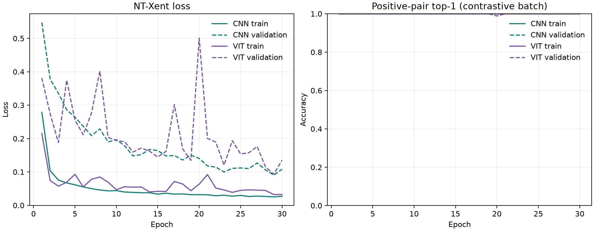

# GeoRAG Milestone 3: contrastive encoder baseline

## Purpose

This experiment moves GeoRAG from verified encoder computation to learned EO embeddings. It trains a small CNN and a small ViT from random initialization on EuroSAT-MS, using paired geometric views of each tile. The goal is to validate the data-to-embedding training path and compare an exact nearest-neighbor diagnostic. It is not a claim of semantic retrieval quality.

## Protocol

The corpus contains 27,000 multispectral tiles, each loaded as `[13, 64, 64]`. The existing label-stratified split provides 21,600 training, 2,700 validation, and 2,700 held-out test tiles. The test split was not used in training or diagnostics. Band-wise normalization uses statistics computed from the training split.

For each training tile, two independent, deterministic D4 views are sampled: 0/90/180/270-degree rotations, optionally followed by a horizontal reflection. The same spatial operation is applied to all 13 bands, without interpolation or cropping. This encodes the assumption that tile orientation does not define scene identity. Each model outputs a unit-length 128-dimensional vector.

For batch size `B=64`, the two view batches produce `z1,z2 ∈ R^(64×128)`. The implementation concatenates them into `Z ∈ R^(128×128)` and forms `S = Z Zᵀ / τ`, with `τ=0.1`. It masks the diagonal, then uses the matching view of the same tile as the target in symmetric cross-entropy:

`L = -(1/(2B)) Σ_i log( exp(S[i,p(i)]) / Σ_{a≠i} exp(S[i,a]) )`

where `p(i)=i+B` for the first view half and `p(i)=i-B` for the second. Each anchor has one positive and 126 in-batch negatives. Training uses AdamW (`lr=3e-4`, `weight_decay=1e-4`), FP32, seed 17, and 30 epochs per model. CNN initialization uses seed 17 and ViT initialization seed 18. The CNN has 112,864 parameters; the ViT has 1,894,208.

## Learning curves



Both models quickly reach near-perfect positive-pair top-1. That metric only asks whether a tile's second augmentation is the highest-scoring in-batch candidate; it saturates early here and does not measure whether different tiles with similar land-surface content are neighbors. Validation NT-Xent is more discriminating: CNN best validation loss was 0.0905 at epoch 29; ViT best was 0.0929 at epoch 29. Their final validation losses were 0.1084 and 0.1354, respectively. ViT validation loss fluctuated more, including a large transient increase around epoch 20.

## Exact embedding-neighbor diagnostic

For each model, the best-validation-loss checkpoint embeds all training and validation tiles. Each validation vector is compared exactly by cosine similarity against the 21,600 training vectors. The table reports the fraction of its top-`k` neighbors with the same EuroSAT class label.

| Encoder | Parameters | Peak allocated CUDA memory | Label agreement @1 | @5 | @10 |
|---|---:|---:|---:|---:|---:|
| CNN | 112,864 | 172 MiB | 0.883 | 0.838 | 0.808 |
| ViT | 1,894,208 | 2,165 MiB | 0.701 | 0.655 | 0.627 |

On this setup, the CNN gives stronger same-label neighborhoods with fewer parameters and lower memory. This is evidence about this split and objective only. EuroSAT labels are broad proxies for relevance, not human judgments; cross-class neighbors may still be useful, and same-class neighbors may be visually dissimilar. The label-stratified split is not geographically blocked, so these values do not measure spatial generalization.

## Execution and recovery

Both runs used an NVIDIA RTX 5060 Laptop GPU. Four persistent data-loader workers improved the first measured CNN epoch from 214 seconds with one worker to 74 seconds; typical active epoch medians were 40 seconds (CNN) and 69 seconds (ViT). Several recorded epoch durations were much longer because the workstation paused while the processes remained open. The run checkpoints allowed recovery after interruption: CNN resumed from epoch 15, and ViT from epoch 5.

The original CNN checkpoint did not contain the sampler generator state. From the restart point onward, the runner therefore uses deterministic per-epoch sampler seeds. This preserves reproducibility of each subsequent epoch but means the resumed sample order is not identical to a hypothetical uninterrupted run. The run metadata records this. The same restart boundary was applied to ViT for consistent recovery behavior. Model and AdamW state were restored, and the curves retain the complete 30-epoch histories.

## Artifacts

Reproduce with:

```powershell
uv run python scripts/train_contrastive.py --config configs/milestone_3.toml
```

Resume an interrupted run with `--resume`. Detailed metrics, checkpoints, run metadata, per-model plots, exact neighbor diagnostics, and the cross-model summary are in `experiments/milestone_3/` (local run artifacts are Git-ignored). The tracked figure above is copied from the generated comparison plot.

## Next experiment

Implement exact Flat retrieval as the ground-truth engine and inspect query/result image grids. Build relevance judgments from selected examples before evaluating ANN recall or claiming scene-level semantic retrieval. This keeps embedding-neighbor label agreement separate from actual retrieval quality.
