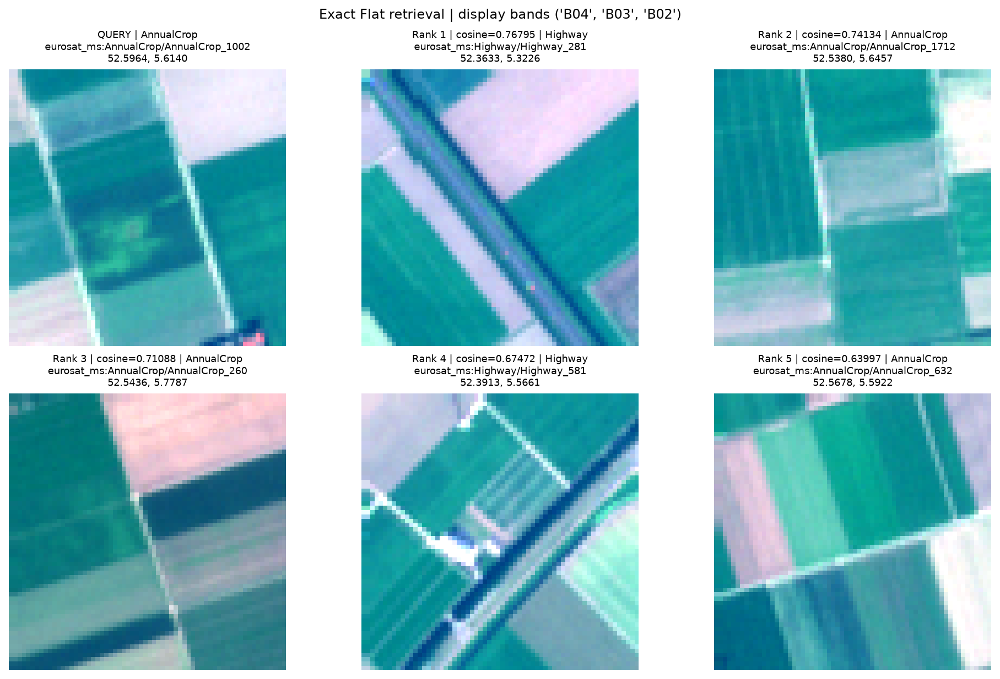
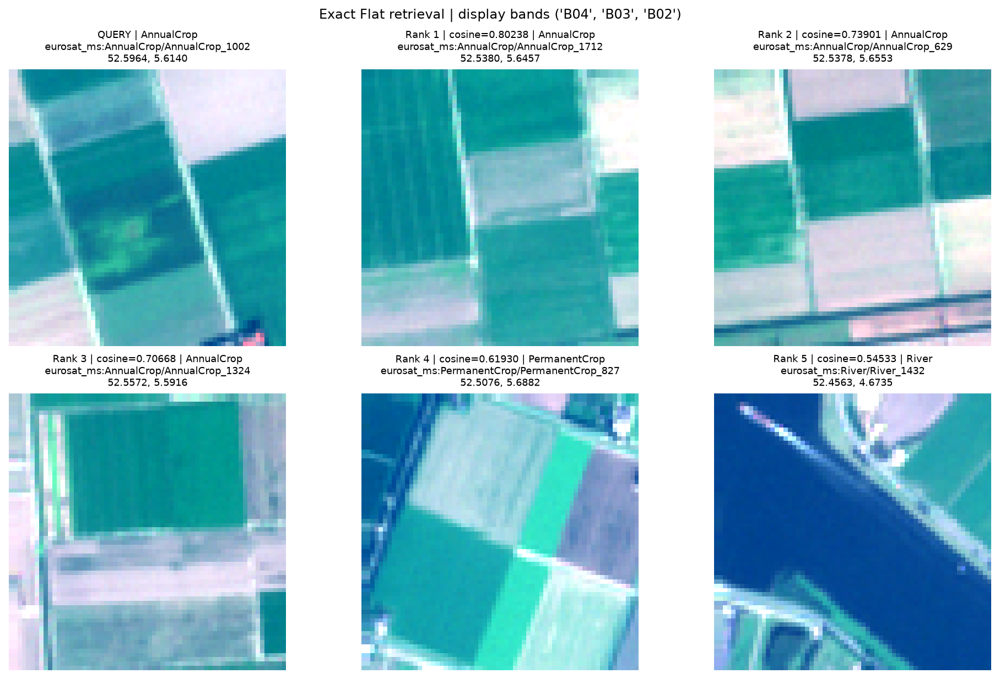

# GeoRAG Milestone 5: exact Flat image retrieval

## Purpose

M5 implements the exact image-to-image retrieval baseline over the two M4 embedding corpora. It searches every training vector for a held-out validation tile, returns ranked tile records and scores, and displays the query beside the retrieved examples. This is the reference against which later ANN indexes will be measured.

## Method

The reference implementation is exhaustive NumPy search on CPU. For each query vector `q`, it scores every row `x_i` in the training matrix using one of:

- cosine similarity: `q^T x_i / (||q|| ||x_i||)`, sorted descending;
- inner product: `q^T x_i`, sorted descending;
- Euclidean distance: `||q - x_i||_2`, sorted ascending.

The M4 vectors are L2-normalized, so cosine and inner product rankings agree. Also, `||q - x_i||_2^2 = 2 - 2 q^T x_i` for unit vectors, so Euclidean distance induces the same ranking. Ties are broken by tile ID for deterministic output.

Each search artifact records the query, metric, candidate split/count, elapsed scoring time, and complete result metadata. The image grid uses the natural-color B04/B03/B02 display composite; it is a visualization of the multispectral source, not the embedding input reduced to RGB.

## Example run

The deterministic first validation tile was `eurosat_ms:AnnualCrop/AnnualCrop_1002` (class label `AnnualCrop`). Its 21,600 training candidates were searched in both model spaces. The complete grids are shown below.

### CNN results



| Rank | Tile label | Cosine score |
|---:|---|---:|
| 1 | Highway | 0.76795 |
| 2 | AnnualCrop | 0.74134 |
| 3 | AnnualCrop | 0.71088 |
| 4 | Highway | 0.67472 |
| 5 | AnnualCrop | 0.63997 |

### ViT results



| Rank | Tile label | Cosine score |
|---:|---|---:|
| 1 | AnnualCrop | 0.80238 |
| 2 | AnnualCrop | 0.73901 |
| 3 | AnnualCrop | 0.70668 |
| 4 | PermanentCrop | 0.61930 |
| 5 | River | 0.54533 |

For this query, direct scoring of the full training corpus confirmed that cosine, inner product, and Euclidean distance produced the same Top-5 order for both encoders. One measured query took 4.096 ms for CNN and 2.632 ms for ViT on the local CPU reference. These are single-run observations, not a controlled latency benchmark.

## Interpretation and limitations

The retrieved images show that the learned vectors can return visually related agricultural patterns, including results whose broad EuroSAT labels differ from the query. That is useful qualitative evidence, but it does not establish human relevance or generalization. The tile-level split does not enforce geographic separation, and several retrieved tiles are geographically close to the query; this can make retrieval easier than retrieval in unseen regions. EuroSAT labels are also broad proxies, not relevance judgments.

The full-resolution ranked records and output manifest are in the local, Git-ignored directory `artifacts/milestone_5/703518aa9a44_cosine_top5/`. Exact retrieval remains the ground truth for future ANN recall; M7's relevance evaluation remains a separate task.

## Validation

Run the search with:

```powershell
uv run python scripts/search_flat.py --config configs/milestone_4.toml --model both --metric cosine --k 5
```

The full project suite passed: `uv run pytest -q` reported 48 passed. Tests cover hand-computed scores and order, all three metrics, equivalence for normalized vectors, deterministic ties, invalid inputs, metadata alignment, and retrieval-grid output.
