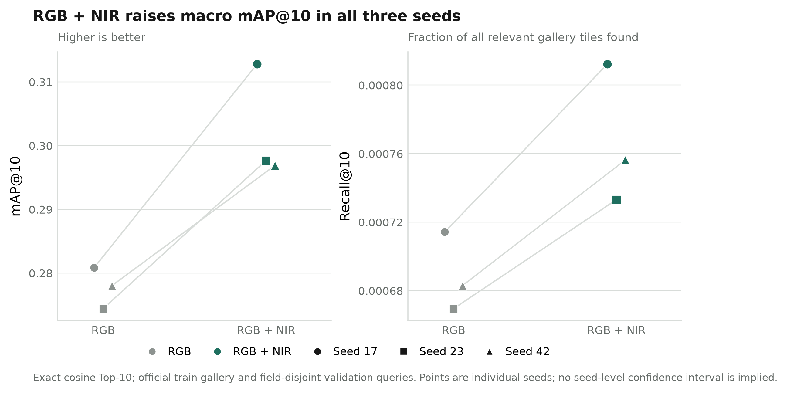
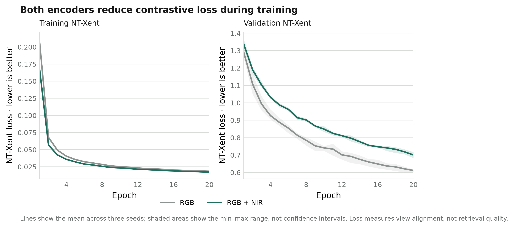

# Milestone 6 — RGB vs. RGB+NIR pattern retrieval

## Status and question

**Complete.** M6 asked whether a small encoder trained from scratch with RGB+NIR can retrieve more tiles containing the same annotated agricultural pattern than a matched RGB-only encoder. It is an image-to-image retrieval experiment, not a classifier, natural-language system, or VLM.

The official Agriculture-Vision train split supplies the retrieval gallery (56,944 tiles); its field-disjoint labeled validation split supplies query tiles (18,334). The test labels are unavailable. The nine anomaly masks define relevance only; they are not fed to the encoder. A tile is positive for a pattern only when its mask overlaps valid pixels inside the field boundary.

## Method

Each tile produces two D4-transformed views for self-supervised NT-Xent learning. The RGB and RGB+NIR runs use the same small CNN design, 128-pixel input, 128-dimensional normalized embedding, optimizer, batch size, epochs, tile splits, and seeds (17, 23, 42). The RGB model receives `[B, 3, 128, 128]`; the RGB+NIR model receives `[B, 4, 128, 128]`. They are trained independently and their embedding vectors are not directly compared.

For each validation query, exact cosine Top-10 search ranks the training gallery. For a target pattern, a gallery tile is relevant when that pattern is annotated on it. Recall@10 is the number of relevant tiles in the first ten divided by all relevant gallery tiles. AP@10 is truncated at ten; the macro result equally averages the nine patterns. Field-cluster bootstrap intervals resample validation fields within each seed. The paired RGB+NIR-minus-RGB intervals therefore describe query-field uncertainty conditional on a trained seed, not uncertainty across training seeds.

## Results

RGB+NIR produced higher macro mAP@10 on all three seeds. Across seeds, the descriptive mean mAP@10 rose from **0.2778** (SD 0.0032) to **0.3024** (SD 0.0090), a mean paired change of **+0.0246** (SD 0.0067). Mean Recall@10 rose from **0.000689** (SD 0.000023) to **0.000767** (SD 0.000041), a mean paired change of **+0.000078** (SD 0.000018). These SDs describe variation across only three seeds; they are not confidence intervals.

| Seed | RGB mAP@10 | RGB+NIR mAP@10 | Paired Δ mAP@10 | RGB Recall@10 | RGB+NIR Recall@10 | Paired Δ Recall@10 |
|---:|---:|---:|---:|---:|---:|---:|
| 17 | 0.2809 | 0.3128 | +0.0319 | 0.000714 | 0.000812 | +0.000098 |
| 23 | 0.2744 | 0.2976 | +0.0232 | 0.000670 | 0.000733 | +0.000064 |
| 42 | 0.2781 | 0.2969 | +0.0188 | 0.000683 | 0.000756 | +0.000073 |



The gain was uneven across patterns. Water had the largest mean paired mAP@10 increase across seeds (+0.152); planter skip declined (−0.031). The table’s interval column is the **envelope of the three seed-specific 95% field-bootstrap intervals**, not a pooled confidence interval.

| Pattern | Positive validation queries | Mean paired Δ mAP@10 | Envelope of per-seed 95% intervals |
|---|---:|---:|---:|
| Double plant | 2,322 | +0.0145 | [−0.0156, +0.0447] |
| Drydown | 5,800 | +0.0284 | [−0.0025, +0.0603] |
| Endrow | 1,754 | +0.0048 | [−0.0102, +0.0189] |
| Nutrient deficiency | 3,883 | +0.0147 | [−0.0207, +0.0526] |
| Planter skip | 1,197 | −0.0306 | [−0.0937, +0.0229] |
| Storm damage | 89 | +0.0032 | [−0.0240, +0.0140] |
| Water | 987 | +0.1520 | [+0.0860, +0.2237] |
| Waterway | 696 | +0.0093 | [−0.0319, +0.0515] |
| Weed cluster | 2,834 | +0.0254 | [+0.0007, +0.0568] |



Both training objectives decreased. RGB+NIR had lower final training loss but higher validation NT-Xent loss than RGB (means 0.01719 vs. 0.01836 for training; 0.70046 vs. 0.61160 for validation). This reinforces that contrastive loss is an optimization diagnostic, not a retrieval-quality score.

## Interpretation and limits

This experiment is evidence that the additional NIR channel helped this specific self-supervised setup on this Agriculture-Vision label-proxy retrieval task, with a large part of the macro mAP change associated with water-pattern queries. It does **not** establish that RGB+NIR is generally better for EO retrieval or that the returned neighbors are useful to agronomists. Most per-pattern seed-specific field-bootstrap intervals include zero; water is the clear and consistent exception, while some patterns have modest support.

Recall@10 is numerically small because its denominator is every relevant training-gallery tile for a pattern, while only ten can be returned. mAP@10 is easier to interpret as ranking quality near the top. Neither metric is human semantic relevance. We did not conduct human relevance judgments, use natural-language queries, add geographic/time constraints, or generate answers. These are separate questions for later milestones.

## Reproduction and artifacts

Run configuration: [`configs/milestone_6.toml`](../configs/milestone_6.toml). The runner supports checkpoints and resuming interrupted seeds:

```powershell
uv run python scripts/run_spectral_retrieval.py --config configs/milestone_6.toml --resume
```

The six full run directories, per-seed field-bootstrap details, embeddings, checkpoints, loss curves, and example grids are local under `experiments/milestone_6/` and ignored by Git. Rebuild this report’s charts with:

```powershell
uv run python scripts/plot_milestone_6_summary.py
```

The full comparison JSON records CUDA/device information, counts, per-query metrics, seed metadata, and paired field-bootstrap results. The test suite covers data indexing/cache behavior, mask semantics, metric calculations, resume, and runner outputs. At M6 completion, all 57 then-existing tests passed; M7 adds additional tests.

Data layout and dataset version: [`data/README.md`](../data/README.md), [Agriculture-Vision challenge dataset](https://www.agriculture-vision.com/agriculture-vision-2021/dataset-2021), and [Agriculture-Vision paper](https://openaccess.thecvf.com/content_CVPR_2020/papers/Chiu_Agriculture-Vision_A_Large_Aerial_Image_Database_for_Agricultural_Pattern_Analysis_CVPR_2020_paper.pdf).
