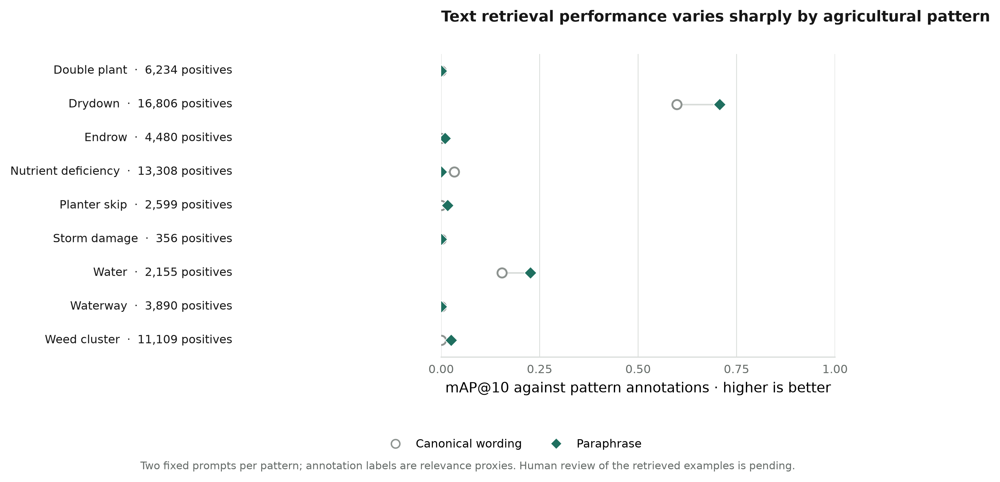

# Milestone 7 — natural-language image retrieval

## Question and scope

Can a natural-language description retrieve annotated agricultural patterns from the GeoRAG image gallery? M7 establishes a pretrained text-to-image baseline. It does not train a new encoder, use multispectral bands, parse geography or time, or generate answers. The input is text; the output is a ranked set of RGB tiles with scores and provenance.

## Method

RemoteCLIP ViT-B/32 encodes both modalities into a shared 512-dimensional space. The query text embedding and every image embedding are L2-normalized. For query vector \(q\) and image vector \(x_i\), exact cosine retrieval is

\[
s(q,x_i)=q^\top x_i,\qquad \|q\|_2=\|x_i\|_2=1.
\]

The runner computes the full exact ranking with the project's NumPy Flat index. It embeds all **56,944 tiles** in the official Agriculture-Vision 2021 train split and evaluates 18 fixed descriptions: a canonical wording and one paraphrase for each of the nine pattern categories. For each description, annotation labels define binary relevance. Prompt-level AP@10, precision@10, and recall@10 are averaged first across the two wordings of each category, then equally across categories. This is an annotation-proxy evaluation, not human semantic judgment.

The image tower uses RemoteCLIP's model-provided RGB transform. The checkpoint was obtained from the [official RemoteCLIP repository](https://github.com/ChenDelong1999/RemoteCLIP) through Hugging Face Hub. Its SHA-256 is `60014e395d930a3f2963d1d89c8522bf4ad56775571e4356e866864789af85c4`. Image embeddings, ordered records, and a manifest are cached locally; the cache identity includes a dataset file fingerprint and checkpoint hash.

## Results

The full run used CUDA on the RTX 5060 Laptop GPU and encoded the gallery in about **171 seconds**. Exact results were:

| Pattern | Positive gallery tiles | mAP@10 | Precision@10 | Recall@10 |
|---|---:|---:|---:|---:|
| Double plant | 6,234 | 0.0000 | 0.000 | 0.000000 |
| Drydown | 16,806 | 0.6528 | 0.850 | 0.000506 |
| Endrow | 4,480 | 0.0050 | 0.050 | 0.000112 |
| Nutrient deficiency | 13,308 | 0.0167 | 0.050 | 0.000038 |
| Planter skip | 2,599 | 0.0083 | 0.050 | 0.000192 |
| Storm damage | 356 | 0.0000 | 0.000 | 0.000000 |
| Water | 2,155 | 0.1904 | 0.300 | 0.001392 |
| Waterway | 3,890 | 0.0000 | 0.000 | 0.000000 |
| Weed cluster | 11,109 | 0.0125 | 0.050 | 0.000045 |
| **Macro (equal weight per pattern)** | — | **0.0984** | **0.150** | **0.000254** |

The result is strongly pattern-dependent. “Drydown” dominates the annotation-proxy score; “water” is a weaker second case; most other categories receive little or no top-10 label agreement. Paraphrases change individual category scores, so wording is already visible as an experimental factor. The per-pattern figure shows canonical wording and paraphrase separately:



The low Recall@10 values are expected with thousands of positive gallery tiles: recall@10 divides the number of relevant results among ten by all relevant gallery tiles for the class. It should not be read as the fraction of queries answered correctly.

## Interpretation and limitations

This run demonstrates the text-to-image plumbing and provides a useful baseline, not a successful general-purpose geospatial question-answering system. Label-based mAP can understate visual relevance when a label is absent and can overstate it when an image carries the label but is not a good answer to the wording. The prompts cover only nine agricultural-pattern names, with two wordings each. There are no independent human relevance labels, confidence intervals over prompts, spatial/date constraints, or comparison to a trained EO image-text model.

The original human review sheet remains untouched. An OpenAI vision audit was run as an automated second opinion. It is explicitly a **VLM-assisted proxy**, not a human relevance audit or independent ground truth. The runner judged each image without seeing its dataset labels, then presented model judgments alongside labels only after scoring.

### VLM-assisted image review

All 45 query–image pairs were judged with the `gpt-5.6` alias, resolved by the API to `gpt-5.6-sol`. The VLM marked **11 relevant, 5 not relevant, and 29 uncertain**. The macro VLM Precision@5 lower bound is **0.244** and upper bound **0.889**, treating uncertain decisions as all irrelevant or all relevant respectively. This wide range says the model could not confidently assess many of these fine-grained crop patterns from the RGB tiles; it does not establish that the retriever succeeded or failed. The model’s confidence field is self-reported and uncalibrated.

| Query pattern | Relevant | Uncertain | Not relevant | VLM Precision@5 bounds |
|---|---:|---:|---:|---:|
| Double plant | 0 | 5 | 0 | 0.00–1.00 |
| Drydown | 3 | 2 | 0 | 0.60–1.00 |
| Endrow | 3 | 1 | 1 | 0.60–0.80 |
| Nutrient deficiency | 0 | 5 | 0 | 0.00–1.00 |
| Planter skip | 0 | 5 | 0 | 0.00–1.00 |
| Storm damage | 1 | 4 | 0 | 0.20–1.00 |
| Water | 1 | 2 | 2 | 0.20–0.60 |
| Waterway | 2 | 1 | 2 | 0.40–0.60 |
| Weed cluster | 1 | 4 | 0 | 0.20–1.00 |

On the 16 definite model decisions, agreement with the dataset class label was 0.563. This is only descriptive label agreement; neither labels nor VLM decisions serve as human relevance ground truth. The API reported 22,620 input tokens and 5,065 output tokens. The complete per-image evidence and gallery are in the [local VLM audit report](../experiments/milestone_7/vlm_audit/report.md) and [HTML gallery](../experiments/milestone_7/vlm_audit/index.html); experiment outputs are ignored by Git.

## Reproduction and artifacts

```powershell
uv run python scripts/run_text_retrieval.py --config configs/milestone_7.toml --device auto
uv run python scripts/plot_milestone_7_results.py
uv run pytest
```

The fixed descriptions are in `configs/milestone_7_queries.toml`; inference and retrieval parameters are in `configs/milestone_7.toml`. The full run record is `experiments/milestone_7/results.json`. Ignored local artifacts contain the embedding matrix, ordered tile records, cache manifest, audit CSV, and query-result grids. The 64-tile smoke run is only a plumbing test and is not used for these reported metrics.

To rerun or resume the VLM audit, ensure `OPENAI_API_KEY` is available in the environment or project `.env`, then:

```powershell
uv run python scripts/run_vlm_audit.py --limit 1  # one-pair API smoke check
uv run python scripts/run_vlm_audit.py            # all 45 pairs; completed judgments resume
```

The default model is `gpt-5.6`; `--model` can override it. The runner does not call the API during tests. Its ignored output is under `experiments/milestone_7/vlm_audit/`: `judgments.jsonl`, `judgments.csv`, `summary.json`, `report.md`, and `index.html`. The gallery shows each tile, query, rank, VLM decision, short visible-evidence note, confidence, and dataset labels for comparison. Uncertain judgments become explicit lower/upper bounds on VLM Precision@5. The API's reported usage is stored per response.

## Next decision

The VLM audit indicates that RGB crops often do not make these fine-grained agricultural anomalies unambiguous to the model. Next decide whether to refine the query/relevance task, add an explicit multispectral text-to-image baseline, or proceed to ANN indexing while keeping ANN recall separate from semantic relevance. M7 is deliberately RGB because this RemoteCLIP checkpoint has an RGB image tower; it does not answer whether NIR improves text-to-image retrieval.
