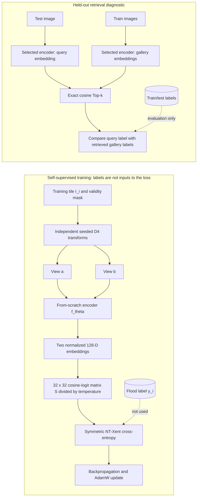

# M9: SEN12-FLOOD representation experiment

## Status

The mask-aware data and training pipeline is implemented. The four-condition one-epoch smoke run and all 12 configured full training/evaluation runs are complete. Each full run produced a checkpoint, metrics curve, exact test-to-train retrieval diagnostics, and provenance artifacts.

The smoke run validates data flow, model input/output shapes, checkpointing, and exact retrieval plumbing. It used only 32 gallery scenes and 16 queries per condition; the selected smoke queries happened to be no-flood scenes. Its apparent 100% Top-k label agreement is a tiny-subset artifact and must not be interpreted as retrieval performance.

## Question and experimental conditions

The narrow question is: under a matched self-supervised training protocol, do all twelve Sentinel-2 optical bands produce better held-out flood/no-flood evidence neighbors than visible RGB alone, and does the answer depend on CNN versus ViT architecture?

The matrix is:

| Encoder | Input channels |
|---|---|
| CNN trained from scratch | Sentinel-2 B04/B03/B02 (RGB) |
| CNN trained from scratch | All twelve optical bands |
| Small ViT trained from scratch | Sentinel-2 B04/B03/B02 (RGB) |
| Small ViT trained from scratch | All twelve optical bands |

Each condition uses seeds 17, 23, and 42. Images are aligned to the per-scene B05 20 m grid by the M8 adapter. RGB uses the same common-valid-pixel mask as the full spectral stack, so its statistics and training exclude pixels invalid in any configured band.

## Method

- **What is the learning problem?** Each available SEN12-FLOOD observation has an image tensor \(I_i\) and a scene/date-level label \(y_i\in\{\text{flood},\text{no-flood}\}\). A conventional supervised classifier would train from pairs \((I_i,y_i)\) to predict \(y_i\). M9 does **not** do that: the label is not a model input or loss target (although records retain labels as metadata). Instead, each image produces two transformed views; the tile identity supplies the positive-pair relationship. The flood label is used only after training to measure whether retrieved train-gallery neighbors share the held-out query's label.
- **Training data unit:** one source tile \(I_i\in\mathbb R^{C\times256\times256}\), with its validity mask and metadata. The pair sampler creates \((T_{i,a}(I_i),T_{i,b}(I_i))\), where \(T_{i,a}\) and \(T_{i,b}\) are independently sampled D4 transforms. The two views have the same tile ID, but there are no cross-tile positives in M9.
- **Batch and objective:** a batch of \(B=16\) source tiles creates two batches of views, each with shape \([16,C,256,256]\). Encoding and concatenation gives \(Z\in\mathbb R^{32\times128}\). The training objective forms \(S=ZZ^\top/\tau\in\mathbb R^{32\times32}\), after L2 normalization, with \(\tau=0.1\). For row \(a\), the target is the other augmentation of the same tile; its other 30 non-self candidates are negatives. The diagonal self-similarity is masked to \(-\infty\). The loss is cross-entropy over all 32 anchor rows:

  $$
  \mathcal L_{\mathrm{NT-Xent}} = -\frac{1}{2B}\sum_{a=1}^{2B}\log\frac{\exp(S_{a,p(a)})}{\sum_{b\ne a}\exp(S_{a,b})},
  $$

  where \(p(a)\) indexes the paired view. This makes the positive view score high relative to other views in the batch. It does not directly teach the model what a flood looks like; same-scene-date labels are not semantic positives or negatives in this objective.
- **Optimization and selection:** each condition/seed starts from random initialization. AdamW uses learning rate `3e-4` and weight decay `1e-4`; training runs for 20 epochs in FP32 without a learning-rate scheduler. Training pairs are deterministically regenerated by seed, epoch, tile ID, and view index. Validation uses fixed D4 views and the same NT-Xent loss; the checkpoint with the lowest validation loss is used for test embedding and retrieval. Both training and validation loaders drop incomplete batches (`drop_last=True`).
- **Training progress metric:** `positive_top1` is the fraction of the 32 views whose paired augmentation is their highest-scoring non-self view. It is a contrastive-training diagnostic, not flood classification accuracy or retrieval relevance.
- **Evaluation problem:** after checkpoint selection, images are embedded without augmentation. The 1,708 train images form the gallery and the 220 test images form queries. For normalized embeddings, exact cosine similarity is the dot product, \(s(q,x_i)=q^\top x_i\). At each \(k\), the reported label agreement is the fraction of the top-\(k\) gallery items whose scene/date label equals the query label. The train labels are used only for this post-training metric; test labels are used only to group the diagnostic by query class. Validation and test images do not enter fitted normalization or gradient updates.
- **Interpretation:** the task is self-supervised representation learning followed by a weak label-consistency retrieval diagnostic. It is neither supervised flood/no-flood classification nor a human relevance evaluation. A same-label neighbor can still be visually or geographically irrelevant, and a different-label neighbor can still be useful evidence for another query.

### Training and evaluation flow



### Encoder tensor shapes

The input channel count \(C\) is 3 for B04/B03/B02 RGB or 12 for the configured Sentinel-2 optical stack. Both encoders normalize each input band using train-split, valid-pixel statistics and produce a unit-length vector in \(\mathbb R^{128}\).

```mermaid
flowchart TB
    subgraph CNN[Three-stage CNN]
        X1[Input: B x C x 256 x 256]
        X1 --> C1[Conv 3x3 stride 2, GroupNorm 8, SiLU: 32 x 128 x 128]
        C1 --> C2[Conv 3x3 stride 2, GroupNorm 8, SiLU: 64 x 64 x 64]
        C2 --> C3[Conv 3x3 stride 2, GroupNorm 8, SiLU: 128 x 32 x 32]
        C3 --> CP[Adaptive average pool: B x 128]
        CP --> CL[Linear projection: B x 128]
        CL --> CN[L2 normalize: B x 128]
    end
    subgraph ViT[Small ViT]
        X2[Input: B x C x 256 x 256]
        X2 --> P[16 x 16 patches: 256 tokens; flatten each to C x 16 x 16]
        P --> PE[Linear patch projection: B x 256 x 192]
        PE --> CLS[Add CLS token and positional embeddings: B x 257 x 192]
        CLS --> BL[4 pre-LN transformer blocks; 3 heads; MLP width 768]
        BL --> CF[Final norm on CLS token: B x 192]
        CF --> VP[Linear projection: B x 128]
        VP --> VN[L2 normalize: B x 128]
    end
```



- **CNN:** three explicit stride-2 convolution stages change spatial size `256 -> 128 -> 64 -> 32` and channels `C -> 32 -> 64 -> 128`. Each stage uses a 3x3 convolution, GroupNorm with 8 groups, and SiLU. Adaptive average pooling reduces the final `128 x 32 x 32` feature map to 128 values before the 128-D projection and L2 normalization.
- **ViT:** non-overlapping 16x16 patches yield 256 patch tokens. Each flattened patch has `C * 16 * 16` values and is projected to width 192. A learned class token and positional embeddings produce 257 tokens, processed by four pre-layer-normalized transformer blocks with three attention heads and a 768-wide MLP. The final class-token representation is projected to 128 dimensions and L2 normalized.
- **Parameter counts:** CNN RGB 109,984; CNN 12-band 112,576; ViT RGB 2,001,728; ViT 12-band 2,444,096. The image-side patch projection depends on \(C\), so these are matched backbone/protocol comparisons rather than exactly parameter-matched modality ablations.

#### Data, preprocessing, and split

- Input cache: 2,138 available scenes, disk-backed float32 `[N,12,H,W]` plus bool common-validity `[N,H,W]`; source path, size, modification time, and preprocessing settings fingerprint the cache.
- Images are aligned to the per-scene B05 20 m grid. Channelwise population mean and standard deviation are computed over valid pixels in the training-sequence split only. Invalid normalized pixels are zero. RGB selects B04/B03/B02 statistics from the training-only twelve-band statistics, while retaining the common-validity mask.
- The deterministic 80/10/10 split groups by exact SEN12-FLOOD sequence token, with seed 17. All training sequences are the retrieval gallery; all test sequences are queries. Validation and test sequences do not enter fitted normalization or model-gradient updates.
- Augmentation: two reproducible independent D4 views per tile. Right-angle rotations and reflection assume orientation is not semantic identity; imagery and masks receive identical transforms without interpolation.
- Retrieval metric: exact cosine Top-k label-neighbor agreement for image/date-level flood/no-flood labels. This is a weak dataset-label proxy, not a human relevance study, flood segmentation metric, or proof that imagery visually demonstrates flooding.

Run configuration is checked in at `configs/milestone_9.toml`. Commands:

```powershell
uv run python scripts/inspect_sen12flood.py
uv run python scripts/run_sen12flood_contrastive.py --smoke
uv run python scripts/run_sen12flood_contrastive.py
uv run python scripts/plot_milestone_9.py artifacts/milestone_9/runs/<run-directory>
uv run python scripts/export_milestone_9_neighbors.py artifacts/milestone_9/runs/<run-directory>
```

The local inspection figure is `artifacts/milestone_9/data_review.png`. The neighbor exporter writes per-run exact Top-10 CSV files and true-color visual sheets for representative held-out queries. Experiment outputs, including the approximately 6.7 GB tensor cache, remain ignored by Git.

## Full-run results

All twelve runs completed: four conditions × seeds 17, 23, and 42. Every model used 1,708 training scenes, 210 validation scenes, and 220 held-out test scenes. The test split contains 73 flood and 147 no-flood queries; the training gallery contains 377 flood and 1,331 no-flood scenes. Those class proportions make the overall score majority-class-sensitive.

The table reports exact cosine Top-5 label agreement as mean ± sample standard deviation across the three seeds. “Flood” and “No flood” columns average query-level Top-5 precision separately for each query class. “Macro” is the unweighted mean of those two class-specific values.

| Encoder | Input | Overall | Flood queries | No-flood queries | Macro across classes |
|---|---|---:|---:|---:|---:|
| CNN | RGB | 0.733 ± 0.008 | 0.480 ± 0.007 | 0.859 ± 0.013 | 0.669 ± 0.006 |
| CNN | 12 bands | 0.741 ± 0.011 | 0.538 ± 0.039 | 0.841 ± 0.015 | 0.690 ± 0.016 |
| ViT | RGB | 0.695 ± 0.012 | 0.393 ± 0.027 | 0.845 ± 0.008 | 0.619 ± 0.015 |
| ViT | 12 bands | 0.688 ± 0.020 | 0.406 ± 0.034 | 0.828 ± 0.020 | 0.617 ± 0.022 |

In this setup, 12-band input raised CNN macro Top-5 label agreement by about 2 percentage points, driven by a roughly 5.8 point increase for flood queries and a small decrease for no-flood queries. The ViT result was essentially unchanged on the macro metric. These are descriptive differences across only three seeds, not evidence of a general multispectral advantage. All models perform much better on no-flood queries than flood queries; the weighted overall scores obscure that imbalance.

The encoder structures were matched by family and shared depth/width, but total parameter counts were not identical because the input projection depends on channel count. CNN: 109,984 parameters for RGB and 112,576 for 12 bands. ViT: 2,001,728 for RGB and 2,444,096 for 12 bands (about 22% more in the 12-band ViT). Treat the modality comparison as a matched-protocol study, not an exact capacity-controlled ablation; a shared or factorized spectral patch stem would be needed to remove this confound.

The loss figure is `artifacts/milestone_9/runs/20261006_051147/milestone_9_summary.png`. Exact Top-10 results are in each run's `exact_neighbors.csv`; the seed-17 visual sheets are in the corresponding `retrieval_examples.png` files. The experiment directory's `run.json` records device, Torch version, data/cache fingerprint, split hash, base Git commit, and dirty-tree state. The copied config, epoch metrics, checkpoints, embeddings, and labels remain local under ignored `artifacts/`.

The results answer only: “Do nearest image embeddings share the scene-level flood/no-flood label?” They do not establish human relevance, flood extent, or natural-language question answering. The visibly strong class asymmetry and the ViT parameter-count mismatch motivate the next controlled evaluation rather than a claim that a selected encoder is already useful for GeoRAG.

## Interpretation limits

- SEN12-FLOOD labels describe a scene/date and can remain positive in later observations; they are not pixel masks.
- Same-label neighbors measure label consistency, not whether a result answers a nuanced natural-language question.
- Results apply to this Kaggle copy, its observed sequence split, the shared-validity mask, the chosen D4 invariance, and the finite training budget.
- RGB and 12-band input conditions share the backbone design and protocol but have different first-layer parameter counts; this is especially noticeable for the ViT patch projection (22% total parameter difference).
- The comparison isolates spectral input within each architecture. CNN and ViT runs are separate learned embedding spaces and their raw vectors are never compared to each other.
- No supervised-contrastive objective, hand-crafted index ranking, SAR input, ANN approximation, query parser, or generated answer is included in M9.
